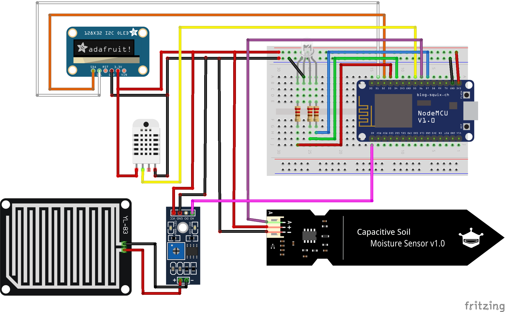

# davedkg-platformio-plantmonitor

## TODOS

- how to calibrate soil moisture sensor wet and dry values
- how to setup in VSCode

## Local Setup

### Credentials

Create src/Credentials.h with the following code.

```cpp
#ifndef CREDENTIALS_H
#define CREDENTIALS_H

char API_DOMAIN[] = "<YOUR_API_DOMAIN>";
char API_KEY[] = "<YOUR_API_KEY>";
char WIFI_DEVICE_NAME[] = "<DEVICE_NAME>";
char WIFI_SSID[] = "<YOUR_NETWORK_NAME>";
char WIFI_PASSWORD[] = "<YOUR_NETWORK_PASSWORD>";

#endif
```

## Hardware

- ESP8266 NodeMCU CP2102 ESP-12E
- DHT22 Digital Temperature and Humidity Sensor
- EK1940 Capacitive Soil Moisture Sensor
- SSD1306 128x32 OLED Screen
- RGB Led with 3 x 220 ohm resistors
- Breadboard and wires

## Wiring Diagram

